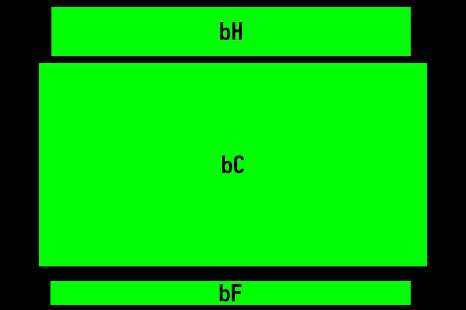

# Rendering Graphics

Espruino devices with an LCD have an instance of the
[Graphics class](https://www.espruino.com/Reference#Graphics) at `g`, this
built-in object renders straight to the LCD. There is lots of great
documentation on using the Graphics instance over on the Espruino website:

- [https://www.espruino.com/Graphics](https://www.espruino.com/Graphics)

## Typical Usage

There are a few typical things you may want to call as part of creating your
apps:

```js
// Clear the whole screen
g.clear();

// Draw some text, notice you can (and should) chain calls to graphics
g.setFontMonofonto23().setFontAlign(0,0).
```

## Buffers

Each aspect of the user interface on the Pip-Boy 3000 Mk.V is rendered to the
screen via a set of graphics buffers, a graphics buffer is essentially like a
bitmap image that is "blit" to the display each time the `flip()` method is
called. Each buffer is allocated a specific area of RAM and to render to the
display you would write the pixels you want to display to the buffer and then
when it's ready to be displayed those bits are moved from RAM to the display.

There are three buffers in total, `bH`, `bC` and `bF`, these are 'header',
'content' and 'footer' respectively, as shown in the image below.



You can probably tell from how they're laid out above, what each buffer is
responsible for, most pages/apps will render to `bC`, `bH` and `bF` will
typically render the header and footer navigation.
